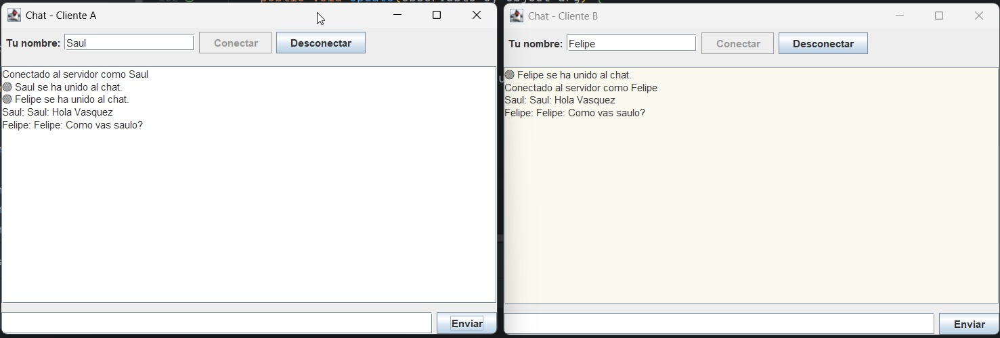

# 📖 GUÍA RÁPIDA DEL PROYECTO: CHAT SOCKETS EN JAVA CON SWING Y POSTGRESQL ⚙️
Este proyecto es una aplicación de escritorio desarrollada en **Java Swing** que utiliza **sockets TCP/IP** para permitir la 
comunicación en tiempo real entre múltiples clientes a través de un **servidor de chat.**
Además, implementa persistencia de datos en **PostgreSQL** para registrar las conversaciones de los usuarios.
El propósito del proyecto es **aprender y practicar conceptos de programación en red con Java**, manejo de hilos, 
entrada/salida de datos y conexión a bases de datos mediante **JDBC.**

_Autor: Saul Echeverri_   
_Edición: 2025_



## Comenzando 🚀
Este proyecto es una aplicación educativa construida con fines de aprendizaje para comprender:
- La comunicación entre cliente y servidor mediante Sockets.
- El uso de **Threads (hilos)** para manejar múltiples conexiones simultáneas.
- La creación de interfaces gráficas simples con Java Swing.
- La persistencia de mensajes en PostgreSQL con JDBC.

El proyecto está inspirado en el curso **Java y MySQL** de **La Tecnologia Avanza de Cristian** publicado en
la plataforma de Youtube

---
## 1. REQUISITOS DEL SISTEMA ⚙️
Para ejecutar este proyecto, necesitas tener instalados los siguientes componentes:

### Instalación 🔧

A continuación, se describen los pasos para configurar y ejecutar este proyecto Java en tu entorno de desarrollo.

#### Requisitos Previos
Antes de comenzar, asegúrate de tener los siguientes requisitos previos en tu sistema:

- **IntelliJ IDEA** (u otro IDE compatible con Java)
- **Conexión a Internet** para descargar dependencias vía Maven
- **Java Development Kit (JDK):** Debes tener instalado Java Development Kit (JDK) en tu sistema. Este proyecto requiere
  JDK 17 o una versión superior. Puedes descargar y configurar JDK desde el sitio oficial de [Oracle](https://www.oracle.com/java/technologies/javase-downloads.html) o [OpenJDK](https://adoptopenjdk.net/).
- **Maven**: Gestor de dependencias que se utilizó para administrar las bibliotecas y las dependencias del proyecto.
    Puedes encontrar más información sobre Maven en [https://maven.apache.org/](https://maven.apache.org/).


  Para verificar si Java está instalado, puedes abrir una terminal y ejecutar el siguiente comando:

   ```shell
   java -version
   ```

- **PostgreSQL**: Asegúrate de tener PostgreSQL instalado en tu sistema. Puedes obtener más información en su [sitio oficial](https://www.postgresql.org/download/).
- **Driver JDBC para PostgreSQL**: La dependencia necesaria para que la aplicación Java se conecte a la base de datos.
  Si usas Maven, asegúrate de tener la siguiente dependencia en tu pom.xml:

    ```xml
    <dependency>
        <groupId>org.postgresql</groupId>
        <artifactId>postgresql</artifactId>
        <version>42.5.4</version>
    </dependency>
    ```
- **Git**: instalalo en su sitio oficial [Git](https://git-scm.com/) si deseas clonar el repositorio.


#### Clonar el Repositorio

Para comenzar, clona este repositorio en tu máquina local usando Git:

```shell
git clone https://github.com/saulolo/stored-procedures.git
```

## Despliegue 📦

En esta sección, se proporcionan instrucciones y notas adicionales sobre cómo llevar tu proyecto a un entorno de
producción o cómo desplegarlo para su uso.

### Despliegue Local 🏠

Si deseas ejecutar tu proyecto en tu propio entorno local para pruebas o desarrollo, sigue estos pasos generales:

1. **Configura PostgreSQLs**: Asegúrate de tener una base de datos PostgreSQL funcionando. Crea una base de datos con
   el nombre `bd_chat_lta` con una tabla `conversations(id integer, sender varchar, message text)`

2. **Verificar**: que el archivo `Conexion.java` tiene la URL correcta: `bd_chat_lta`.
```java
jdbc:postgresql://localhost:5432/bd_chat_lta
```
3. **Configuración de Variables de Entorno**: Asegúrate de que tu sistema tenga configuradas las variables de entorno JAVA_HOME y PATH para que apunten a
   tu instalación de JDK.

4. **Compilación y Ejecución**: Para compilar y ejecutar el proyecto localmente usando Maven ejecuta el siguiente comando:
```shell
mvn clean install
```
5. **Ejecución**: Ejecuta el **main** la clase: `Server`
Deberías ver: `Servidor de chat iniciado en el puerto 5000`

6. **Ejecutar los clientes**: Abre y ejecuta las clases:
   `CustomerA`
   `CustomerB`
Cada cliente representa un usuario distinto; Escribe un nombre, conéctate y comienza a chatear. 
Los mensajes se mostrarán en ambas ventanas y se registra

El proyecto se ejecutará en tu servidor local en http://localhost:8080.


📌 **Instrucciones para ejecutarlo desde DBeaver (PostgreSQL):**

1. Abre DBeaver y conéctate a tu servidor de PostgreSQL.
2. Si no existe la base de datos `bd_chat_lta`, créala:
- Haz clic derecho sobre el servidor > **Create > Database**
- Nómbrala: `bd_chat_lta`

---
## 2. ESTRUCTURA DEL PROYECTO 🏗️
El proyecto sigue una arquitectura Model-View-Controller (MVC) básica para organizar las responsabilidades de cada clase, 
lo que facilita el mantenimiento y la escalabilidad.

```ja
chat-sockets/
├── src/
│   └── main/
│       ├── java/
│       │   └── chat_sockets/
│       │       ├── data/
│       │       │   ├── Conexion.java
│       │       │   ├── ConversationDAOImpl.java
│       │       │   ├── IConversationDAO.java
│       │       │   └── Server.java
│       │       ├── domain/
│       │       │   └── Customer.java
│       │       └── view/
│       │           ├── CustomerA.java
│       │           ├── CustomerB.java
│       │           ├── CustomerA.form
│       │           └── CustomerB.form
│       └── resources/
└── pom.xml 
```

-   `chat_sockets.data:`
    -  `Conexion.java`: La capa de acceso a datos. Utiliza el patrón Singleton para asegurar una única instancia de 
    conexión a la base de datos.
    - `ConversationDAOImpl.java`: Implementa la lógica para guardar los mensajes enviados por los clientes.
    - `Server.java`: Es el servidor principal del chat. Recibe y retransmite los mensajes entre clientes.
- `chat_sockets.domain`:
    -  `Customer.java`: LRepresenta un cliente que puede conectarse al servidor y enviar mensajes.
- `chat_sockets.view`:
    -  `CustomerA.java / CustomerB.java`: nterfaz gráfica Swing para los usuarios del chat. Permite conectarse, enviar 
  mensajes y ver la conversación. 

Todos los mensajes enviados por los clientes se almacenan automáticamente en la tabla conversations de PostgreSQL.
Cada registro incluye:
CampoTipoDescripciónidSERIALIdentificador únicosenderVARCHAR(100)Nombre del remitentemessageTEXTContenido del 
mensajecreated_atTIMESTAMPFecha y hora del mensaje

---
## 3. Sockets 🗃️
Un **socket** es un punto final de comunicación entre dos programas a través de una red.
En Java, los sockets permiten que un **cliente** y un **servidor** intercambien datos en tiempo real mediante flujos de 
entrada y salida.

- **ServerSocket**: se utiliza en el servidor para esperar y aceptar conexiones en un puerto específico.
- **Socket**: se utiliza en el cliente para conectarse al servidor y enviar o recibir mensajes.

La comunicación se realiza a través de **streams** (InputStream y OutputStream), lo que permite construir aplicaciones 
como chats, juegos o sistemas distribuidos que requieren **comunicación bidireccional y en tiempo real**.


### Beneficios Clave ✅
- **Comunicación en tiempo real:**: permiten el intercambio inmediato de datos entre cliente y servidor.
- **Conectividad flexible:**: soportan comunicación local (LAN) o remota (Internet) sin cambios en el código.
- **Bajo nivel de control**: ofrecen acceso directo al flujo de datos, ideal para aplicaciones personalizadas. 
- **Independencia del protocolo:**: pueden trabajar sobre TCP (confiable) o UDP (rápido y ligero).
- **Alta eficiencia:**: reducen la latencia al mantener una conexión directa y persistente entre las partes.
- **Versatilidad:**: se usan para construir chats, juegos multijugador, aplicaciones colaborativas, servicios web, entre 
otros.

En este proyecto, el **servidor** (Server.java) escucha conexiones entrantes en el puerto 5000.
Cada **cliente (CustomerA / CustomerB)** se conecta mediante sockets TCP.
Los mensajes se transmiten entre clientes a través del servidor.
Todos los mensajes se guardan en la base de datos PostgreSQL mediante **ConversationDAOImpl**.

### Métodos Principales de Clases JDBC

| Clase                 | Principales Métodos       | Descripción                                                                                                 |
|:----------------------|:--------------------------|:------------------------------------------------------------------------------------------------------------|
| **Connection**        | `createStatement()`       | Crea un objeto `Statement` para ejecutar consultas SQL estáticas.                                           |
|                       | `prepareStatement(sql)`   | Crea un objeto `PreparedStatement` para ejecutar consultas SQL parametrizadas de forma segura.              |
|                       | `prepareCall(sql)`        | Crea un objeto `CallableStatement` para invocar procedimientos almacenados y funciones de la base de datos. |
| **Statement**         | `execute(sql)`            | Ejecuta cualquier tipo de sentencia SQL, devolviendo `true` si es un `ResultSet`.                           |
|                       | `executeQuery(sql)`       | Ejecuta una consulta `SELECT` y devuelve los resultados en un objeto `ResultSet`.                           |
|                       | `executeUpdate(sql)`      | Ejecuta sentencias `INSERT`, `UPDATE` o `DELETE` y devuelve el número de filas afectadas.                   |
|                       | `close()`                 | Cierra el `Statement`, liberando sus recursos.                                                              |
| **PreparedStatement** | `setXXX(index, value)`    | Establece el valor de un parámetro en una posición específica (ej. `setString(1, "valor")`).                |
|                       | `execute()`               | Ejecuta la sentencia SQL precompilada. Puede ser usada para cualquier tipo de operación.                    |
| **ServerSocket**      | `accept()`                | Espera una conexión entrante y devuelve un objeto Socket cuando un cliente se conecta.                      |
|                       | `close()`                 | Cierra el socket del servidor, deteniendo la aceptación de nuevas conexiones.                               |
| **Socket**            | `getInputStream()`        | Obtiene el flujo de entrada para recibir datos del servidor o cliente.                                      |
|                       | `getOutputStream()`       | Obtiene el flujo de salida para enviar datos.                                                               |
| **PrintWriter**       | `println(String s)`       | Envía una línea de texto al flujo de salida.                                                                |
|                       | `write(String s)`         | Escribe texto en el flujo sin salto de línea.                                                               |
|                       | `flush()`                 | Fuerza el envío inmediato de los datos pendientes en el flujo.                                              |
| **BufferedReader**    | `readLine()`              | Lee una línea completa del flujo de entrada.                                                                |
|                       | `ready()`                 | Verifica si hay datos disponibles para leer sin bloquear.                                                   |
| **Thread**            | `start()`                 | Inicia la ejecución de un hilo que ejecuta el método run().                                                 |
| 	                     | `sleep(ms)`               | Suspende la ejecución del hilo durante un tiempo determinado.                                               |
| 	                     | `interrupt()`             | Interrumpe el hilo si está bloqueado o esperando.                                                           |


---
## 4. CONTRIBUYENDO 🖇️

¡Gracias por tu interés en contribuir a este proyecto! Aquí hay algunas reglas y pautas para enviar contribuciones:

### Reglas para Enviar Solicitudes de Extracción (Pull Requests) 🔀

1. Antes de enviar una solicitud de extracción, asegúrate de que tu código esté bien probado y sea compatible con la
   rama principal.

2. Sigue un estilo de código consistente.

3. Si tu contribución agrega nuevas características, proporciona documentación clara sobre cómo utilizar esas
   características.

### Informar Problemas 🐞

Si encuentras errores o problemas en el proyecto, por favor, abre un issue para informarnos. Proporciona detalles claros
sobre el problema, incluyendo pasos para reproducirlo.

### Comunicación 💬

Me encanta escuchar tus ideas y responder tus preguntas. Siempre puedes [contactarme](https://www.linkedin.com/in/saul-echeverri-duque/) para discutir el proyecto o plantear cualquier pregunta que tengas.

¡Espero que te unas a nuestra comunidad de contribuyentes y espero tus valiosas contribuciones!

### ¿Dónde obtener ayuda? 🆘

Si tienes preguntas o necesitas ayuda durante el proceso de contribución, no dudes en [contactarme](https://www.linkedin.com/in/saul-echeverri-duque/) o abrir un issue para obtener asistencia.

¡Espero trabajar contigo en este proyecto y agradecemos tu ayuda o sugerencias para mejorarlo!


## Autor ✒️

¡Hola! Soy **Saul Echeverri Duque** 👨‍💻 , el creador y desarrollador de este proyecto. Permíteme compartir un poco sobre mi
formación y experiencia:

### Formación Académica 📚

- 🎓 Graduado en Ingeniería de Alimentos por la Universidad de Antioquia, Colombia.
- 📖 Titulado en Tecnología en Análisis y Desarrollo de Software por el SENA.

### Trayectoria Profesional 💼

- 👨‍💻 Cuento con más de tres años de experiencia laboral en el campo del desarrollo de software.
- 🌟 Durante mi trayectoria, he tenido el privilegio de trabajar en diversos proyectos tecnológicos, donde he aplicado
  mis conocimientos en programación y análisis.
- 🏢 Actualmente, formo parte de [IAS Software](https://www.ias.com.co/), una empresa de software en Medellín, Colombia,
  donde sigo creciendo profesionalmente y contribuyendo al mundo de la tecnología.

### Pasión por la Programación 🚀

- 💻 Mi viaje en el mundo de la programación comenzó en el 2021, y desde entonces, he estado inmerso en el emocionante
  universo del desarrollo de software.
- 📚 Uno de mis mayores intereses y áreas de enfoque es **Java**, y este proyecto es el resultado de mi deseo de compartir
  conocimientos y experiencias relacionadas con este lenguaje.
- 🤝 Estoy emocionado de colaborar y aprender junto a otros entusiastas de Java.

Estoy agradecido por la oportunidad de compartir este proyecto contigo y espero que te sea útil en tu propio camino de
aprendizaje y desarrollo. Si tienes alguna pregunta, sugerencia o simplemente quieres charlar sobre tecnología, no dudes
en ponerte en contacto conmigo. ¡Disfruta explorando el mundo de Java!

¡Gracias por ser parte de este proyecto! 😊


## Licencia 📄

Este proyecto se basa en el curso **Java y MySQL** de **La Tecnologia Avanza (Cristian Ramirez)**  y se
desarrolla con fines educativos y de aprendizaje del lenguaje de Java. La utilización de los
ejercicios y contenido del proyecto se realiza en concordancia con los derechos de uso permitidos por el autor y su curso.

**Nota Importante**: Este proyecto no se distribuye bajo una licencia de código abierto estándar, ya que está destinado
principalmente para fines personales y educativos. Si deseas utilizar o distribuir el contenido de este proyecto más
allá de los fines educativos personales, asegúrate de obtener los permisos necesarios del autor.

Es importante respetar los derechos de autor y las restricciones legales asociadas con el contenido del cuerso en el que
se basa este proyecto.


## Expresiones de Gratitud 🎁

Quiero expresar mi más sincero agradecimiento a [Cristian Ramirez](https://www.youtube.com/@latecnologiaavanza/videos),
propietario del canal **La Tecnologia Avanza**, cuya obra ha sido la fuente de inspiración  y aprendizaje fundamental para
este proyecto. Su dedicación a la enseñanza y la claridad de su canal han sido invaluables para mí durante la creación
de este proyecto.

Si encuentras este proyecto útil y te gustaría expresar tu gratitud de alguna manera, aquí hay algunas opciones:

* Comenta a otros sobre este proyecto 📢: Comparte este proyecto con tus amigos, colegas o en tus redes sociales para
  que otros también puedan beneficiarse de él.

* Invita una cerveza 🍺 o un café ☕ a alguien del equipo: Siéntete libre de mostrar tu aprecio por el esfuerzo del
  autor o del único miembro del equipo (yo) comprándoles una bebida virtual.

* Da las gracias públicamente 🤓: Puedes expresar tu agradecimiento públicamente en el repositorio del proyecto, en los
  comentarios, o incluso en tu blog personal si lo deseas.

* **Dona a través de una cuenta bancaria** 💰: Si prefieres hacer una donación en efectivo o mediante transferencia
  bancaria, puedes hacerlo a la siguiente cuenta de ahorros en Bancolombia: 230-1588-1151. Tu generosidad será muy
  apreciada y contribuirá al mantenimiento y mejora de este proyecto.

¡Gracias por ser parte de este viaje de aprendizaje y desarrollo!


---
## Créditos 📜

Este proyecto fue desarrollado con ❤️ por [Saul Echeverri](https://github.com/saulolo) 😊.

Si tienes preguntas, comentarios o sugerencias, no dudes en ponerte en contacto conmigo:

- GitHub: [https://github.com/saulolo](https://github.com/saulolo) 🌐
- Correo Electrónico: [saulolo@gmail.com](saulolo@gmail.com) 📧
- LinkedIn: [https://www.linkedin.com/in/saul-echeverri-duque/](https://www.linkedin.com/in/saul-echeverri-duque/) 💼

---
### METADATOS DEL DOCUMENTO 📄


| Campo           | Detalles                                                              |
| :-------------- |:----------------------------------------------------------------------|
| **Título** | GUÍA RÁPIDA DEL PROYECTO: CHAT SOCKETS EN JAVA CON SWING Y POSTGRESQL |
| **Autor(es)** | Saul Echeverri                                                        |
| **Versión** | 1.0.0                                                                 |
| **Fecha de Creación** | 24 de Octubre de 2025                                                 |
| **Última Actualización** | 24 de Octubre de 2025                                                 |
| **Notas Adicionales**  | Documento base para referencia rápida de los Sockets.                 |

---

